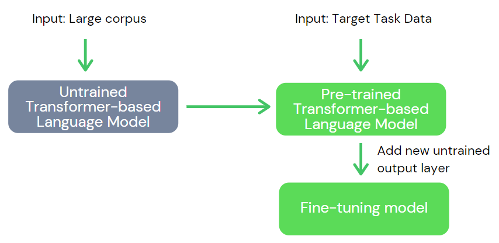
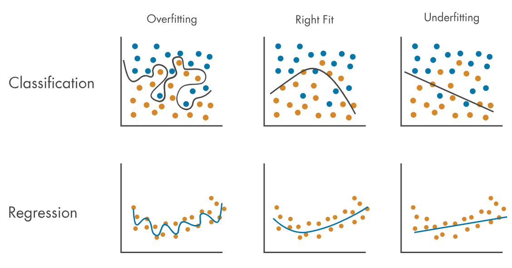
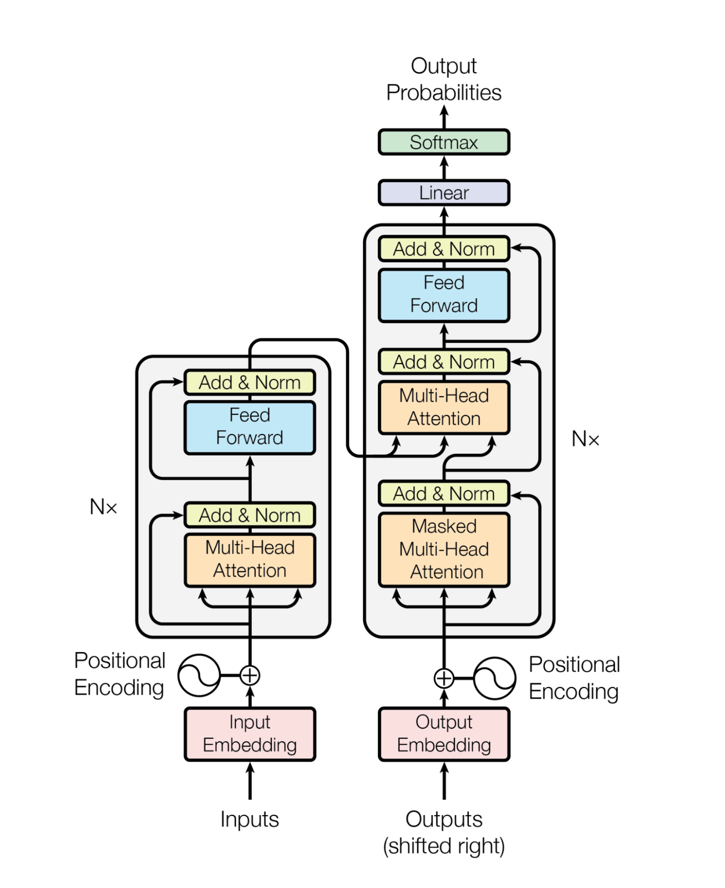
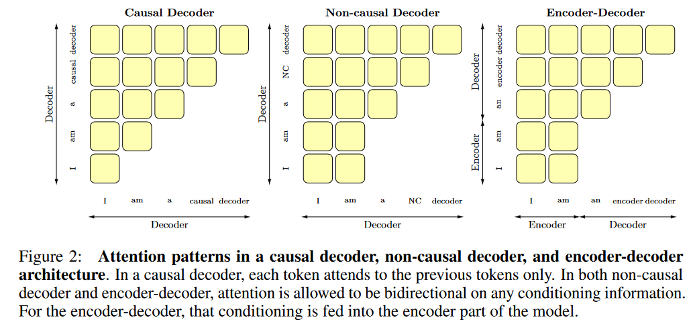

  
   
  OpenLLM Glossary

## Modèle de language géant (Large Language Model, LLM)
Un réseau de neuronnes artificiel destiné à modéliser le language naturel, et dôté d'un très grand nombre de paramètres numériques (540Md pour Google PaLM, 170Md pour GPT3, 40Md pour Falcon).

## Réseau de neuronnes artificiel (Artificial Neural Network, ANN)
Les réseaux de neuronnes artificiels tentent de répliquer la structure du cerveau (des neuronnes, reliés entre eux par des connexions, les synapses). Un ANN est une succession de couches de neuronnes ; chaque connexion comptant pour un paramètre, que l'on appelle _poids_. Plus le poids d'une connexion est grand, plus la connexion est forte, et plus le neuronne de sortie répondra positivement à une forte stimulation du neuronne d'entrée.

La structure la plus basique d'un ANN est la structure _Feed Forward_, ou tous les neuronnes composant chaque couche sont reliés à tous les neuronnes de la couche suivante. Il existe évidemment des structures plus complexes de ANN, utilisés en _Computer Vision_ comme en _Natural Language Processing_.

  
   
  Un ANN simple (<a href="https://deepai.org/machine-learning-glossary-and-terms/feed-forward-neural-network">source</a>)

Lorsqu'on parle "d'entrainer un modèle", on fait référence au fait de rechercher itérativement la valeur optimale de ses paramètres. Le procédé mathématique associé est la _déscente de gradient stochastique_.

## Modèle fondation (Foundation Model)
Un LLM ayant été suffisamment entrainé pour comprendre les propriétés fondamentales du language naturel : structure des phrases, raisonnement de bases, etc. Cependant, un modèle fondation n'est **pas encore prêt à être utilisé** car il n'a pas encore été entrainé à réaliser des taches concrètes, comme le résumé de textes, la traduction, l'analyse de sentiments...

GPT1 a montré qu'il est plus efficace de d'abord pré-entrainer des LLM sur des datasets de grande taille, avant de le spécialiser dans des taches concrètes à travers une étape de [Fine-tuning](#fine-tuning) (plus d'informations disponibles dans cette section).

**Ce sont les modèles fondation qui concentrent les enjeux des LLM open-source aujourd'hui.** Constituer un jeu d'entrainement puis pré-entrainer un LLM à plusieurs centaines de millions de paramètres requiert une puissance de calcul très importante. De ce fait, les grands projets comme [Bloom](https://arxiv.org/abs/2211.05100) ou plus récemment [Falcon](https://huggingface.co/blog/falcon) visent à entrainer des modèles fondation open-source, prêts au [Fine-tuning](#fine-tuning), de sorte à ce que les chercheurs ou universitaires n'ayant pas accès à de tels moyens puissent tout de même faire travailler sur ces modèles massivement pré-entrainés, afin de faire avancer le domaine des LLM.

## Fine-Tuning
Aujourd’hui, les LLMs sont d’abord pré-entrainés sur de gigantesques datasets d’entrainement grâce à l'apprentissage semi-supervisé (sans l'invervention systématique de l'homme). Ces datasets d'entrainement sont collectés puis filtrés automatiquement grâce à Internet : blogposts, articles scientifiques, réseaux sociaux...

Seulement, ce pré-entrainement à lui seul n’est pas assez efficace pour apprendre au modèle à effectuer une tache spécifique concrète (appelée _downstream task_), comme la traduction, le résumé de texte... Souvent, ce pre-training n’apprend au modèle que des propriétés générales du langage : signification du vocabulaire, structure des phrases, raisonnements de base...

Le fine-tuning consiste à entrainer dans un second temps un LLM pré-entrainé, dans le but de lui apprendre une de ces taches particulières. Cette étape est alors bien moins coûteuse que le pré-entrainement, car le modèle a déjà assimilé les propriétés générales du langage.

Souvent, cette étape de l'entrainement est réalisée avec un dataset plus réduit en taille, car les données nécessaires nécessitent l'intervention humaine : écriture de résumés, évaluation de textes générés,  labélisation des données...

  
   
  Entrainement standard d'un LLM (<a href="https://fatyanosa.medium.com/fine-tuning-pre-trained-transformer-based-language-model-c542af0e7fc1">source</a>)

Cette pratique n'est pas du tout pas spécifique au NLP : en _Computer Vision_ par exemple, la technique des _LoRA_ permet d'apprendre aux fameux modèles de type _Stable Diffusion_ des connaissances picturales sans avoir à ré-entrainer tout le modèle (seulement une infime partie de connexions judicieusement positionnées).

## Instruction-Tuning
Il s'agit d'un type spécifique de fine-tuning. On apprend au modèle à bien réagir face à des instructions du type "Peux-tu me résumer le texte suivant: [...]" ou encore "Traduit en anglais la phrase suivante: [...]". Il s'agit d'instructions que l'utilisateur pourrait vouloir fournir à un ChatBot tel que ChatGPT pour intéragir avec un modèle de manière conversationnelle.

## Apprentissage par renforcement avec retour humain (Reinforcement learning from Human Feedback, RLHF)
Le reinforcement learning fait référence à une technique d'apprentissage où le LLM évolue dans un environnement fictif : cet environnement fournit à chaque instant un état au LLM, qui effectue des décisions en fonction desquelles il se voit récompenser. Il s'agit de la troisième technique majeure d'apprentissage, en plus de _l'apprentissage supervisé_ et de _l'apprentissage non supervisé_.

Le RLHF consiste concrètement en une boucle fermée où les éxaminateurs stimulent le modèles puis en corrige les prédictions afin de l'améliorer continuellement. En pratique pour les LLM, il est principalement utilisé en conjonction avec un entrainement type [Fine-tuning](#fine-tuning), par exemple pour bannir certaines réponses jugées dangeureuses ou vulgaires.

## Underfitting, Overfitting

L'overfitting est un problème rencontré lorsque le modèle trop adapté à un dataset particulier. Dès lors, il sous-performera lorsque utilisé en dehors de sa "zone de confort" par rapport à un même modèle, moins entrainé. Pour résoudre l'overfitting, il faut moins entrainer le modèle ou augmenter la qualité (taille, diversité) du dataset pour le rendre plus complexe.

L'underfitting est simplement l'inverse, cela fait référence à un [ANN](#réseau-de-neuronnes-artificiel-artificial-neural-network-ann) qui sous-performe car il n'a pas été assez entrainé sur un dataset particulier : il n'arrivera alors pas à en capter toutes les subtilités et renverra une "réponse approchée" de faible qualité. Pour résoudre l'underfitting, il faut plus entrainer le modèle.

  
   
  Overfitting et Overfitting (<a href="https://fr.mathworks.com/discovery/overfitting.html">source</a>)

## Hallucination
Une hallucination est une réponse produite par le modèle d'IA, qui peut patraître correcte, mais qui n'est pas justifiée par ses données d'entraînement. Souvent, le modèle parait sur de lui lorsqu'il hallucine.

Cette définition peut être choisie plus ou moins stricte. Par exemple, dans le domaine du résumé automatique de texte, une hallucination peut aussi désigner le fait que le modèle rajoute des éléments au résumé qui ne figurent pas dans le texte.

Quelques exemples :
- On fournit l'input suivant "Quand est né Napoléon ?" et l'output est "Napoléon est né en 2087 en Corse."
- On fournit l'input suivant "Résumer la phrase suivante. Emmanuel Macron a donné ce matin de nouveaux éléments sur la question de la réforme des retraites, dont les contours semblent se préciser." et l'output est "Emmanuel Macron, invité ce matin *à France Inter*, a précisé le contenu de la réforme des retraites."

> [How to Reduce the Hallucinations from Large Language Models](https://thenewstack.io/how-to-reduce-the-hallucinations-from-large-language-models/)\
> [Page Wikipédia sur les hallucinations en NLP](https://en.wikipedia.org/wiki/Hallucination_(artificial_intelligence))

Generative Pre-Trained Transformer (GPT) fait référence à une famille de [transformeurs](#transformeur-transformer), au-delà des modèles développés par OpenAI. Ces modèles ont une structure de decoder-only et sont des [Causal Language Models](#causal-language-modeling). L'objectif de pré-entraînement est la prédiction du token suivant (next token prediction). Cela leur permet à partir d'un contexte donné de générer une séquence de tokens en rajoutant à chaque fois le dernier token généré à l'input.

## Transformeur (Transformer)
Structure particulière de [modèle de language géant](#modèle-de-language-géant-large-language-model-llm). [Depuis 2017](https://arxiv.org/abs/1706.03762), il s'agit de la famille de LLMs avec laquelle on obtient les meilleures performances dans le traitement du langage naturel dans toutes les tâches communes : traduction, ChatBot, résumé de texte, . Il a remplacé les _réseaux de neurones récurrents_ (RNN) dont l'un des points faibles est l'établissement de relations entre des mots distants.

Son atout est son système d'[attention](#attention) qui lui permet d'exploiter les relations entre les mots (notamment les références telles que "il" ou "ce dernier"), pour inférer la signification d'une phrase.

La structure initiale transformeur est composée une pile d'[encodeurs](#modèles-encoder-only-encoder-only-models) connectée à une pile de [décodeurs](#generative-pre-trained-transformerdecoder-only-model), même si cette dernière a été largement adaptée depuis. Aujourd'hui, les LLM les plus performants suivent une architecture type de [Decoder-Only](#generative-pre-trained-transformerdecoder-only-model) même si les structures de type [Encoder-Only](#modèles-encoder-only-encoder-only-models) sont encore utilisées pour la classification ou la mesure de performances de modèles, entre autres.

  
   
  Structure initiale du transformeur (<a href="https://arxiv.org/abs/1706.03762">source</a>)

## Modèles Encoder-Only (Encoder-Only Models)
Les modèles Encoder-Only n'utilisent que la partie encodeur du transformeur. Ils visent à encoder une certaine quantité d'informations ainsi qu'une compréhension globale sur la phrase en entrée, sous la forme de représentation vectorielle. Les couches d'attention formulent les liens entre tous les tokens d'entrée, c'est la _self-attention_.

Ces modèles sont souvent utilisés pour la classification de phrases et la classification de mots. Une technique très efficace (qui minimise le coût de l'entrainement) est de simplement fine-tuner un LLM Encoder-Only pré-entrainé tel que [BERT](https://arxiv.org/abs/1810.04805) (_Bidirectional Encoder Representations from Transformers_) développé par Google.

Le pré-entraînement d'un tel LLM consiste principalement en la reconstitution d'une phrase bruitée, où des mots ont été retirés, masqués, inversés etc. Les phrases sont tirées d'un corpus de données puis bruitées avec une fonction de bruitage, c'est donc de l'entraînement semi-supervisé.

>Un cours sur les modèles Encoder-Only est disponible [sur HuggingFace](https://huggingface.co/learn/nlp-course/chapter1/5?fw=pt).

## Modèles Encoder-Decoder (Encoder-Decoder Models)
Il s'agit de la structure qui avait été présentée dans le [papier initial du transformeur](https://arxiv.org/abs/1706.03762). Ce modèle est composé d'un [encodeur](#modèles-encoder-only-encoder-only-models), dont la fonction est d'encoder la phrase i.e en trouver une représentation vectorielle qui tient compte de sa signification, et d'un [décodeur](#generative-pre-trained-transformerdecoder-only-model), dont la fonction est de générer un texte, étant donné le contexte fourni par l'encodeur.

Les modèles Encoder-Decoder ne sont majoritairement plus développés, étant donné que de meilleures performances sont obtenus plus simplement par les modèles de type Decoder-Only. On peut tout de même citer [BART](https://arxiv.org/abs/1910.13461) qui est resté pendant quelques mois l'état de l'art en 2019 en texte de tâches génératives, ou encore [T5](https://ai.googleblog.com/2020/02/exploring-transfer-learning-with-t5.html) (_Text-to-Text Transfer Transformer_) dont la spécifité est de traiter toutes les _drownstream tasks_ en langage naturel brut ("traduit en français: [...]" ou "résume ce texte: [...]").

## Apprentissage en contexte (N-shot learning)

Le _N-shot learning_ est une technique de [prompt](#prompt). Pour réaliser une tâche spécifique, N exemples sont pourvus dans le prompt, avec la requête de l’utilisateur. On parle aussi de _In-context learning_ ([Page Wikipédia](https://en.wikipedia.org/wiki/In-context_learning_(natural_language_processing))).

En particulier, le zero-shot learning vise à réaliser la tâche demandée en fournissant seulement les instructions nécessaires, sans aucun exemple.

Le few-shot learning consiste à donner quelques exemples dans le contexte. Ces techniques se rapprochent de ce que nous, humains, utilisons pour expliquer une nouvelle tâche à quelqu’un.

Voici un exemple de prompt de 1-shot learning “Infirmier → infirmière ; boulanger → “.

>Cette notion était ambiguë jusqu’à ce qu’OpenAI propose une définition commune dans le [papier de GPT3](https://arxiv.org/abs/2005.14165).

## Prompt

Un _prompt_ est une chaîne de caractères passée en input d’un modèle. Il regroupe les informations et/ou instructions nécessaires à la réalisation de la tâche ainsi que des informations additionnelles pour l’aider à comprendre sa tâche.

Exemple:
- “Traduire la phrase suivante en français : Linagora is a good company. → “
- “Mettre au pluriel les mots suivants : chien → chiens ; chat → chats ; cheval → “

Certains modèles sont entraînés sur des jeux de données déjà promptés pour des tâches spécifiques. Dans ces cas-là, pour réaliser ces tâches, il peut être plus efficace de reprendre la même structure de prompt.

T5, un modèle [Encoder-Decoder développé par Google](https://arxiv.org/abs/1910.10683), est fine-tuné pour plusieurs tâches (multitask finetuning), dont le résumé de texte. Ainsi, si l'on veut lui soumettre un texte à résumer, il suffit d'utiliser le prompt "summarize: " suivi du texte.

> [Guiding Large Language Models towards Task-Specific Inference - Prompt Design and Soft Prompts](https://towardsdatascience.com/guiding-a-huge-language-model-lm-to-perform-specific-tasks-prompt-design-and-soft-prompts-7c45ef4794e4)

## Modélisation causale de language (Causal Language Modeling, CLM)

C'est un type de modèle de langage qui s'applique aux transformeurs de type Decoder-Only. On considère une séquence de tokens placée en entrée d'un modèle de ce type. Pour un token donné, le processus d'attention fait uniquement référence à tous les tokens qui le précèdent.

GPT d'OpenAI appartient à ce type de modèles de langage.

  
   
  Patternes d'attention (<a href="https://arxiv.org/abs/1706.03762">source</a>)

> [UL2: Unifying Language Learning Paradigms](https://arxiv.org/abs/2205.05131)\
> [What Language Model Architecture and Pretraining Objective Work Best for Zero-Shot Generalization?](https://arxiv.org/abs/2204.05832)

## Attention

C'est un mécanisme utilisé pour représenter les liens relatifs entre les tokens d'entrée et leur importance, dans la structure des modèles. Ainsi, la représentation vectorielle de chaque token dépend de celle des autres tokens.

Concrètement, ce sont plusieurs couches supplémentaires qui sont placées dans la structure du [transformeur](#transformeur-transformer), et dont certains paramètres sont entraînés. Plus précisemment, on retrouve des couches d'attention dans chaque couche d'encodeur et de décodeur d'un transformeur.

>Voici un [blogpost de haute qualité](https://jalammar.github.io/visualizing-neural-machine-translation-mechanics-of-seq2seq-models-with-attention/) expliquant le mécanisme d'attention.

## GPU

Un GPU (_Graphics Processing Unit_) est un processeur composé de nombreux coeurs, plus petits et plus spécialisé qu'un CPU (Central Processing Unit). Le GPU permet de facilement paralléliser les calculs, ce qui est particulièrement intéressant pour entraîner les transformeurs.

Le GPU tire son nom de sa première utilisation, un GPU est en effet optimisé pour le calcul parallèle de rendu de scènes 3D en informatique graphique.

Au GPU est associé une certaine quantité de VRAM (_Video Random Access Memory_), mémoire vive qui permet notamment de stocker temporairement (et de manière très accessible) les valeurs des paramètres du modèle de langage pendant le calcul. 

## Quantification (Quantization)

La quantization facilite les calculs au moment de l'inférence ou lors de l'entraînement. Les valeurs des paramètres sont approchées par une représentation de nombres moins volumineuse, ces approximations sont utilisées pour le calcul puis stockées. Cela réduit les exigences en terme de mémoire vive.

On peut mentionner l'algorithme 8-bit optimizer, qui permet de diminuer par 4 les besoins du modèle en mémoire vive si les valeurs des paramètres sont codées sur 32 bits, en perdant relativement peu de précision.

> Nous vous incitons à aller regarder le tutoriel OpenLLM pour [finetuner Bloom avec en utilisant qLoRA](https://colab.research.google.com/github/OpenLLM-France/Tutoriel/blob/main/01_qlora_fine_tuning.ipynb)\
Egalement, voici la présentation de la [bibliothèque bitsandbytes pour la quantization](https://huggingface.co/blog/hf-bitsandbytes-integration)